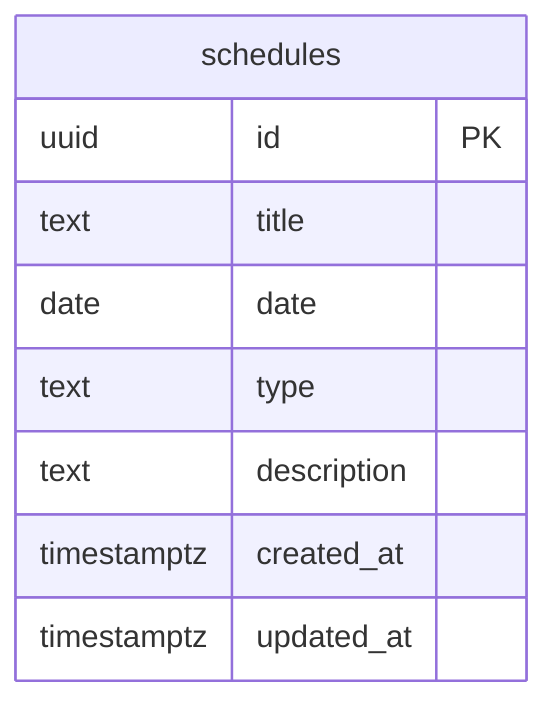

# OK금융그룹 보안팀 대시보드 Supabase EDR 설계

## 1. 개요
- 본 문서는 OK금융그룹 보안팀 대시보드의 실시간 일정 공유를 위한 Supabase 데이터베이스 스키마(ERD/EDR) 설계 문서입니다.
- 모든 사용자가 동일한 일정을 실시간으로 공유/수정/삭제할 수 있도록 설계합니다.

## 2. 주요 테이블

### schedules (일정 테이블)
| 컬럼명      | 타입         | PK | Not Null | 설명                |
| ----------- | ------------ |----|----------|---------------------|
| id          | uuid         | Y  | Y        | 일정 고유 ID        |
| title       | text         |    | Y        | 일정 제목           |
| date        | date         |    | Y        | 일정 날짜           |
| type        | text         |    | N        | 일정 유형(연차 등)  |
| description | text         |    | N        | 상세 설명           |
| created_at  | timestamptz  |    | Y        | 생성일시            |
| updated_at  | timestamptz  |    | Y        | 수정일시            |

- **id**: Supabase에서 기본 제공하는 uuid 자동 생성 사용 권장
- **title**: 일정 제목(필수)
- **date**: 일정 날짜(YYYY-MM-DD, 필수)
- **type**: 일정 유형(연차, 반차, 당직 등, 선택)
- **description**: 상세 설명(선택)
- **created_at/updated_at**: Supabase 자동 타임스탬프

## 3. ERD 다이어그램 (Mermaid)

## 4. 확장/참고 사항
- 사용자별 데이터 분리가 필요할 경우, users 테이블 및 user_id FK 추가 가능
- 일정에 첨부파일, 반복일정 등 추가 컬럼 확장 가능

---

**이 문서를 바탕으로 Supabase에서 schedules 테이블을 생성하면 됩니다.** 