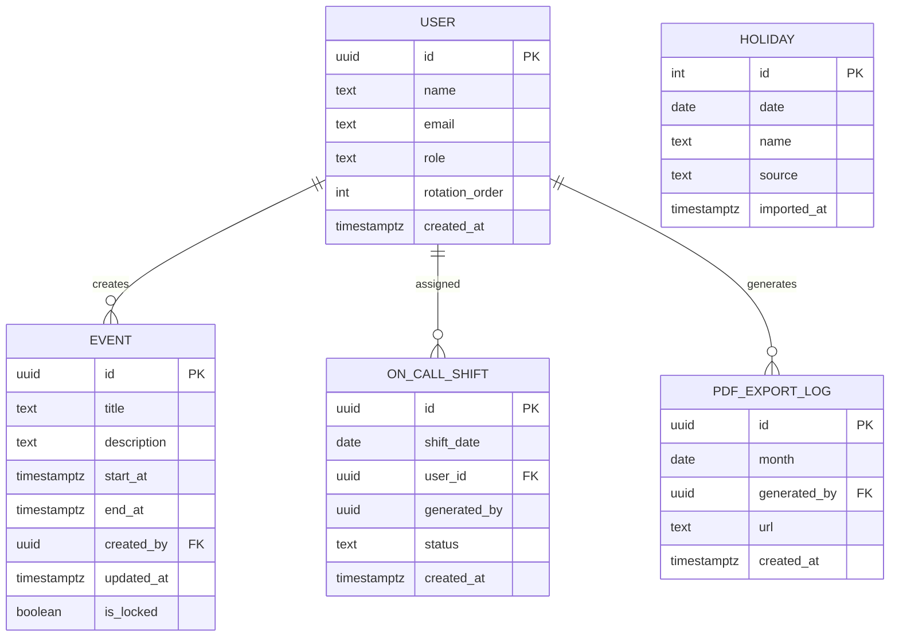

## 목차

1. [엔티티 정의](#엔티티-정의)
2. [속성(컬럼) 명세](#속성컬럼-명세)
3. [관계 매핑](#관계-매핑)
4. [PK / FK 구조](#pk--fk-구조)
5. [인덱스 전략](#인덱스-전략)
6. [제약 조건 및 비즈니스 규칙](#제약-조건-및-비즈니스-규칙)
7. [데이터 타입 & 검증 규칙](#데이터-타입-검증-규칙)
8. [정규화 분석](#정규화-분석)
9. [성능 최적화 고려사항](#성능-최적화-고려사항)
10. [마이그레이션 & 버전 관리 전략](#마이그레이션--버전-관리-전략)
11. [Traceability Matrix](#traceability-matrix)

---

## 엔티티 정의

| 엔티티              | 개요                          |
| ---------------- | --------------------------- |
| **User**         | 팀 구성원의 계정·권한·근무 순번 저장       |
| **Event**        | 일정(근무, 휴가, 회의 등) 정보         |
| **Holiday**      | Naver Calendar API로 수집한 공휴일 |
| **OnCallShift**  | 평일 on-call 담당자 레코드          |
| **PdfExportLog** | 일정 PDF를 생성한 이력              |

---

## 속성(컬럼) 명세

### User

| 컬럼              | 타입                              |  PK |  NN | 기본값                 | 설명                         |
| --------------- | ------------------------------- | :-: | :-: | ------------------- | -------------------------- |
| id              | UUID                            |  ✔  |  ✔  | gen\_random\_uuid() | 사용자 식별자                    |
| name            | TEXT                            |     |  ✔  |                     | 실명                         |
| email           | TEXT                            |     |  ✔  |                     | *@company.com* 도메인, UNIQUE |
| role            | TEXT CHECK (`member`,`manager`) |     |  ✔  | ‘member’            | 권한 구분                      |
| rotation\_order | INT                             |     |     |                     | on-call 순환 순번              |
| created\_at     | TIMESTAMPTZ                     |     |  ✔  | now()               | 계정 생성 시각                   |

### Event

| 컬럼          | 타입             |  PK |  NN | 기본값                 | 설명         |
| ----------- | -------------- | :-: | :-: | ------------------- | ---------- |
| id          | UUID           |  ✔  |  ✔  | gen\_random\_uuid() | 일정 ID      |
| title       | TEXT           |     |  ✔  |                     | 제목         |
| description | TEXT           |     |     |                     | 상세 설명      |
| start\_at   | TIMESTAMPTZ    |     |  ✔  |                     | 시작 시각      |
| end\_at     | TIMESTAMPTZ    |     |  ✔  |                     | 종료 시각      |
| created\_by | UUID → User.id |     |  ✔  |                     | 작성자        |
| updated\_at | TIMESTAMPTZ    |     |  ✔  | now()               | 최종 수정 시각   |
| is\_locked  | BOOLEAN        |     |  ✔  | false               | 과거 달 잠금 여부 |

### Holiday

| 컬럼           | 타입          |  PK |  NN | 기본값     | 설명     |
| ------------ | ----------- | :-: | :-: | ------- | ------ |
| id           | SERIAL      |  ✔  |  ✔  |         | 공휴일 PK |
| date         | DATE        |     |  ✔  |         | UNIQUE |
| name         | TEXT        |     |  ✔  |         | 명칭     |
| source       | TEXT        |     |     | 'NAVER' | 수집처    |
| imported\_at | TIMESTAMPTZ |     |  ✔  | now()   | 수집 시각  |

### OnCallShift

| 컬럼            | 타입                                            |  PK |  NN | 기본값                 | 설명           |
| ------------- | --------------------------------------------- | :-: | :-: | ------------------- | ------------ |
| id            | UUID                                          |  ✔  |  ✔  | gen\_random\_uuid() | Shift PK     |
| shift\_date   | DATE                                          |     |  ✔  |                     | UNIQUE       |
| user\_id      | UUID → User.id                                |     |  ✔  |                     | 담당자          |
| generated\_by | UUID NULL                                     |     |     |                     | 자동 생성이면 NULL |
| status        | TEXT CHECK(`scheduled`,`swapped`,`cancelled`) |     |  ✔  | 'scheduled'         | 상태           |
| created\_at   | TIMESTAMPTZ                                   |     |  ✔  | now()               | 생성 시각        |

### PdfExportLog

| 컬럼            | 타입             |  PK |  NN | 기본값                 | 설명             |
| ------------- | -------------- | :-: | :-: | ------------------- | -------------- |
| id            | UUID           |  ✔  |  ✔  | gen\_random\_uuid() | 로그 PK          |
| month         | DATE           |     |  ✔  |                     | YYYY-MM-01 고정  |
| generated\_by | UUID → User.id |     |  ✔  |                     | 실행자            |
| url           | TEXT           |     |  ✔  |                     | S3/Storage URL |
| created\_at   | TIMESTAMPTZ    |     |  ✔  | now()               | 생성 시각          |

---

## 관계 매핑

| 관계                            | 카디널리티    | 설명                             |
| ----------------------------- | -------- | ------------------------------ |
| User 1 : N Event              | 1\:N     | 사용자가 여러 일정을 작성                 |
| User 1 : N OnCallShift        | 1\:N     | 한 사용자가 여러 on-call 교대 담당        |
| User 1 : N PdfExportLog       | 1\:N     | 한 사용자가 여러 PDF를 생성              |
| Holiday 1 : N OnCallShift(제약) | 1\:N(제외) | 공휴일 날짜에는 Shift 생성 불가 (무결성 트리거) |

### ERD (Mermaid)

---

## PK / FK 구조

| 테이블          | PK | FK                                                |
| ------------ | -- | ------------------------------------------------- |
| User         | id | —                                                 |
| Event        | id | `created_by → User.id`                            |
| Holiday      | id | —                                                 |
| OnCallShift  | id | `user_id → User.id`, `generated_by → User.id(옵션)` |
| PdfExportLog | id | `generated_by → User.id`                          |

---

## 인덱스 전략

| 인덱스                                             | 목적              |
| ----------------------------------------------- | --------------- |
| `idx_user_email_unique` (email UNIQUE)          | 인증·조회           |
| `idx_event_start_end` (start\_at, end\_at DESC) | 기간별 일정 조회 속도 ↑  |
| `idx_event_created_by` (created\_by)            | 사용자별 일정 필터      |
| `idx_holiday_date_unique` (date UNIQUE)         | 공휴일 존재 여부 빠른 확인 |
| `idx_shift_date_unique` (shift\_date UNIQUE)    | 당일 교대 중복 방지     |
| `idx_shift_user_status` (user\_id, status)      | 담당자별 교대 현황      |
| `idx_pdf_month` (month DESC)                    | 월간 PDF 검색       |

> Note: Supabase는 B-Tree 기본. `idx_event_start_end` 는 range 쿼리(`BETWEEN`)를 커버.

---

## 제약 조건 및 비즈니스 규칙

* **CHECK** `Event.end_at > Event.start_at`
* **UNIQUE** `Holiday.date`, `OnCallShift.shift_date`
* **TRIGGER** `prevent_past_month_edit()` → Event.is\_locked = true 인 레코드 UPDATE 거부
* **RLS**: `auth.email LIKE '%@company.com'` AND

  * `creator` 만 UPDATE/DELETE 가능 (Manager는 예외)
* **On-call Rule**: 함수 `generate_shift()` 호출 시 (shift\_date `NOT IN` Holiday.date) AND (요일 ≠ Sat|Sun) 검증

---

## 데이터 타입 & 검증 규칙

* **UUID**: `gen_random_uuid()` (pgcrypto)
* **EMAIL**: `CHECK (email ~* '^[A-Z0-9._%+-]+@company\\.com$')`
* **STATUS**: ENUM 대신 TEXT + CHECK → 변경 유연성 확보
* **TIMESTAMPTZ**: 모두 UTC 저장, 클라이언트에서 KST 렌더

---

## 정규화 분석

* **1NF**: 모든 테이블 원자적 컬럼 유지
* **2NF**: 합성 PK 없음, 부분 종속 X
* **3NF**: 비-키 컬럼이 다른 비-키 컬럼에 종속되지 않음
* **비정규화 없음**: 데이터 규모(연간 < 500 rows/테이블) → 조인 비용 무시 가능

---

## 성능 최적화 고려사항

| 시나리오          | 예시 쿼리                                                                                     | 최적화 포인트                            |
| ------------- | ----------------------------------------------------------------------------------------- | ---------------------------------- |
| 월간 일정 조회      | `SELECT * FROM event WHERE start_at >= $1 AND end_at < $2 ORDER BY start_at;`             | `idx_event_start_end` 범위 스캔만 발생    |
| 당일 on-call 조회 | `SELECT u.name FROM on_call_shift s JOIN user u ON u.id=s.user_id WHERE s.shift_date=$1;` | `idx_shift_date_unique` → PK 1건 조회 |
| 공휴일 존재 여부     | `SELECT 1 FROM holiday WHERE date=$1;`                                                    | UNIQUE 인덱스 사용                      |

> 연결 수(≤20) 대비 DB 작은 규모 → 커넥션 풀 크기 10, `statement_timeout` 2 s 권장.

---

## 마이그레이션 & 버전 관리 전략

1. **Supabase CLI** : `supabase db dump` → Git commit
2. **Semantic Tagging**: `vMajor.Minor.Patch` (스키마 변화 = Major)
3. **Idempotent SQL**: `CREATE TABLE IF NOT EXISTS` 패턴
4. **Backward Compatibility Window**: 1 주일(클라이언트 릴리즈 주기)
5. **Rollback**: Vercel Preview + Supabase snapshot restore

---

## Traceability Matrix

| PRD / Use-Case 기능      | 연관 테이블·컬럼                                             |
| ---------------------- | ----------------------------------------------------- |
| Real-time 캘린더(UC-01)   | Event.\*, User.id                                     |
| KR 공휴일 수집(UC-02)       | Holiday.\*, Event.start\_at                           |
| Weekday On-Call(UC-03) | OnCallShift.\*, Holiday.date, User.rotation\_order    |
| PDF 내보내기(UC-04)        | PdfExportLog.*, Event.*, User.id                      |
| Past-month Lock        | Event.is\_locked, Trigger `prevent_past_month_edit()` |
| *@company.com* 접근제한    | User.email, RLS 정책                                    |
| 실시간 ≤ 1 s              | 모든 테이블(Subscribe 대상: Event, OnCallShift)              |

---
